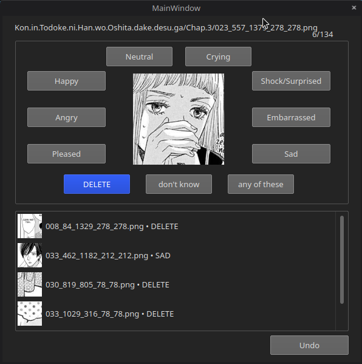

  

## Classification-Labeler

Utility program written in PyQT to label images easily. It has been used to label manga (japanese comic) facial expressions.

## Can i use it? 

Yes but no. Well, the program is too spesific to generalize creating another datasets so you need to make a lot of changes before using it. 